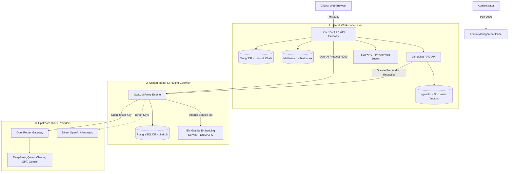

# llm-stack

A production-grade, self-hosted, and fully portable private AI platform combining **LibreChat**, **LiteLLM**, **SearXNG**, and a self-hosted **IBM Granite Embedding Engine**.

---

## 💡 How the Stack Works

The platform is designed with a decoupled, defense-in-depth architecture where all services run in Docker containers over an isolated bridge network (`llm-network`):



### Key Components

1. **LibreChat Web UI & Admin Panel (`ports 3080, 3000`)**
   - Modern, ChatGPT-style collaborative web interface.
   - Built-in Agent builder with artifacts, file uploads, code interpreter, and conversational memory.
   - Pre-configured with three effort-based Agent personas (Low, Medium, High).
   - Dedicated administration panel for managing users and system configuration.

2. **LiteLLM Proxy Gateway (`port 4000`)**
   - Single standardized OpenAI-compatible API endpoint for all models.
   - **Effort-Based Tier Routing:** Instead of hardcoding single models, queries are dynamically load-balanced across model pools using a `least-busy` routing strategy:
     - **Tier 1 (Economy):** High-speed, cost-effective models for quick queries and summaries.
     - **Tier 2 (Workhorse):** Balanced models for general coding, technical Q&A, and documentation.
     - **Tier 3 (SOTA Frontier):** Frontier reasoning models for complex, multi-step technical analysis.
   - Provides automatic fallback retries, key management, spend tracking, and rate limiting.

3. **Self-Hosted IBM Granite Embedding Service (`port 8080`)**
   - Runs `ibm-granite/granite-embedding-125m-english` locally inside a lightweight Python container.
   - Optimized for CPU execution (runs fast without requiring expensive GPUs).
   - Keeps your internal document embeddings completely on-premise for high privacy and zero API costs.

4. **SearXNG Private Search Engine**
   - Self-hosted metasearch engine aggregating Google, Bing, Startpage, and DuckDuckGo without tracking.
   - Enables LibreChat agents to ground their responses in up-to-date real-world data.

---

## 📋 System Prerequisites

- **OS:** Ubuntu 22.04+ / Debian 12 / RHEL 9 (or any modern Linux distribution with Docker support)
- **CPU:** 4+ CPU Cores (x86_64)
- **RAM:** 16 GB RAM recommended (minimum 8 GB)
- **Disk:** 50 GB SSD storage
- **Software:** Docker Engine & Docker Compose v2 (`docker-compose-plugin`)

---

## 🚀 Quickstart: How to Run the Stack

### Step 1: Clone the Repository
```bash
git clone <your-repository-url> /opt/llm-stack
cd /opt/llm-stack
```

---

### Step 2: Initialize the Environment
Run the automated bootstrap script. It verifies Docker, sets up the container network, generates cryptographically secure secrets (`JWT_SECRET`, `CREDS_KEY`, `MEILI_MASTER_KEY`, etc.), downloads the IBM Granite model weights, and builds local container images:

```bash
chmod +x setup.sh llm-stack.sh download-model.sh
./setup.sh
```

---

### Step 3: Post-Setup Configuration (API Keys & Tiers)

> [!IMPORTANT]
> By default, the stack comes with **blank API keys** for portability and security. You must configure your upstream provider key and review model tiers before starting.

#### 1. Add Upstream Provider API Key
Open `Litellm/.env` and paste your provider API key:
```bash
nano Litellm/.env
```
Example (OpenRouter):
```env
OPENROUTER_API_KEY=sk-or-v1-your-actual-api-key-here
```

#### 2. Select Models & Effort Tiers
Open `Litellm/litellm_config.yaml` to customize the models routed to each tier:
```bash
nano Litellm/litellm_config.yaml
```
You can keep the recommended defaults or adjust them to match your team's budget and model preferences.

#### 3. (Optional) Configure Server Domain
In `LibreChat/.env`, configure your server's domain or IP for internal network access:
```bash
nano LibreChat/.env
```
```env
DOMAIN_CLIENT=http://<server-ip>:3080
DOMAIN_SERVER=http://<server-ip>:3080
```

---

### Step 4: Launch the Stack
Use the unified management CLI to spin up all 10 containers in the correct dependency sequence:

```bash
llm-stack start
# Or if not symlinked to PATH:
./llm-stack.sh start
```

---

## 🌐 Web Service URLs

| Service | URL | Default Credentials / Purpose |
| :--- | :--- | :--- |
| **LibreChat Web UI** | `http://<server-ip>:3080` | Register initial admin user on first visit |
| **Admin Panel** | `http://<server-ip>:3000` | User management & configuration |
| **LiteLLM Proxy API** | `http://<server-ip>:4000` | OpenAI-compatible gateway endpoint |
| **Granite Embedding API** | `http://<server-ip>:8080` | Local embedding health & inference |

---

## 🛠️ Management CLI Commands (`llm-stack`)

```bash
# Start all containers in order
llm-stack start

# Check real-time container health and port bindings
llm-stack status

# Stop and tear down all containers cleanly
llm-stack stop

# Restart the entire stack
llm-stack restart

# Stream live container logs (default: LibreChat)
llm-stack logs LibreChat
llm-stack logs litellm_api

# Snapshot databases and configs to a timestamped tarball in backups/
llm-stack backup

# Validate environment and configuration completeness
llm-stack check
```

---

## 🔒 Production Deployment Best Practices

### 1. Automatic Start on Server Reboot (Systemd)
Enable the provided systemd service unit:
```bash
sudo cp llm-stack.service /etc/systemd/system/
sudo systemctl daemon-reload
sudo systemctl enable --now llm-stack.service
```

### 2. HTTPS Reverse Proxy (Nginx)
Place Nginx in front of LibreChat to terminate TLS/SSL:
```nginx
server {
    listen 80;
    server_name ai.your-organization.org;
    return 301 https://$host$request_uri;
}

server {
    listen 443 ssl http2;
    server_name ai.your-organization.org;

    ssl_certificate /etc/ssl/certs/ai-stack.crt;
    ssl_certificate_key /etc/ssl/private/ai-stack.key;

    client_max_body_size 100M;

    location / {
        proxy_pass http://127.0.0.1:3080;
        proxy_http_version 1.1;
        proxy_set_header Upgrade $http_upgrade;
        proxy_set_header Connection "upgrade";
        proxy_set_header Host $host;
        proxy_set_header X-Real-IP $remote_addr;
        proxy_set_header X-Forwarded-For $proxy_add_x_forwarded_for;
        proxy_set_header X-Forwarded-Proto https;
    }
}
```

### 3. Firewall Rules
Expose only web ports to your organization network:
- **Allow:** `80`, `443` (Web traffic via Reverse Proxy)
- **Restrict:** `3000` (Admin panel restricted to IT subnets)
- **Block External:** `4000`, `8080`, `5432`, `27017`, `7700` (Internal container network communication only)
